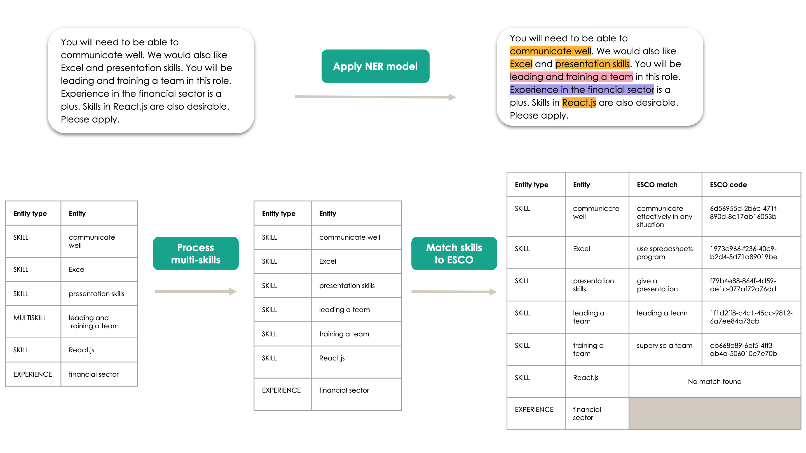

# ojd_daps_skills

ojd_daps_skills is a package designed to extract skills from job adverts, and match them to an existing taxonomy if needed.

This works by:

1. Finding skills in job adverts using a Named Entity Recognition (NER) model.
2. Matching these skills to an existing skills taxonomy using semantic similarity.

Much more about these steps can be found in [this report](outputs/reports/skills_extraction.md).

This package is split into the three pipeline steps:

- [skill_ner](https://github.com/nestauk/ojd_daps_skills/tree/dev/ojd_daps_skills/pipeline/skill_ner)
- [skill_ner_mapping](https://github.com/nestauk/ojd_daps_skills/tree/dev/ojd_daps_skills/pipeline/skill_ner_mapping)
- [evaluation](https://github.com/nestauk/ojd_daps_skills/tree/dev/ojd_daps_skills/pipeline/evaluation)




## Installation

```
pip install ojd_daps_skills
```

If you don't have access to Nesta's S3 buckets then you will first need to download locally the neccessary models and data files (around 850MB) by running:

```
bash public_download.sh
```

## Pre-defined configurations

There are three configurations available for running the skills extraction algorithm.

1. [extract_skills_toy](ojd_daps_skills/config/extract_skills_toy.yaml) - Configuration for a toy taxonomy example, useful for testing.
2. [extract_skills_esco](ojd_daps_skills/config/extract_skills_esco.yaml) - Configuration for extracting skills and matching them to the [ESCO](https://esco.ec.europa.eu/en) skills taxonomy.
3. [extract_skills_lightcast](ojd_daps_skills/config/extract_skills_lightcast.yaml) - Configuration for extracting skills and matching them to the [Lightcast](https://skills.emsidata.com/) skills taxonomy.

These configurations contain all the information about parameter values, and trained model and data locations.

## Basic usage

local=False: For usage by those with access to Nesta's S3 bucket.

local=True (default): For public usage

```
from ojd_daps_skills.pipeline.extract_skills.extract_skills import ExtractSkills

es = ExtractSkills(config_name="extract_skills_toy", local=True)

es.load()

job_adverts = [
        "You will need to have good communication and excellent mathematics skills. You will have experience in the IT sector.",
        "You will need to have good excel and presenting skills. You need good excel software skills",
    ]

predicted_skills = es.get_skills(job_adverts)
job_skills_matched = es.map_skills(predicted_skills)

predicted_skills
>>> [{'EXPERIENCE': ['experience in the IT sector'], 'SKILL': ['communication', 'excellent mathematics skills'], 'MULTISKILL': []}, {'EXPERIENCE': [], 'SKILL': ['excel', 'presenting', 'excel software skills'], 'MULTISKILL': []}]
job_skills_matched
>>> [{'SKILL': [('excellent mathematics skills', ('working with computers', 'S5')), ('communication', ('use communication techniques', 'cdef'))], 'EXPERIENCE': ['experience in the IT sector']}, {'SKILL': [('presenting', ('communication, collaboration and creativity', 'S1')), ('excel software skills', ('use spreadsheets software', 'abcd')), ('excel', ('use spreadsheets software', 'abcd'))]}]
```

## User-defined configurations

For guidance about matching skills to a different taxonomy see [here](ojd_daps_skills/pipeline/extract_skills/README.md).

## Testing

Some functions have tests, these can be checked by running

```
pytest
```

## Setup

- Meet the data science cookiecutter [requirements](http://nestauk.github.io/ds-cookiecutter/quickstart), in brief:
  - Install: `direnv` and `conda`
- Create a blank cookiecutter conda log file:
  - `mkdir .cookiecutter/state`
  - `touch .cookiecutter/state/conda-create.log`
- Run `make install` to configure the development environment:
  - Setup the conda environment
  - Configure `pre-commit`

## Contributor guidelines

[Technical and working style guidelines](https://github.com/nestauk/ds-cookiecutter/blob/master/GUIDELINES.md)

---

<small><p>Project based on <a target="_blank" href="https://github.com/nestauk/ds-cookiecutter">Nesta's data science project template</a>
(<a href="http://nestauk.github.io/ds-cookiecutter">Read the docs here</a>).
</small>
