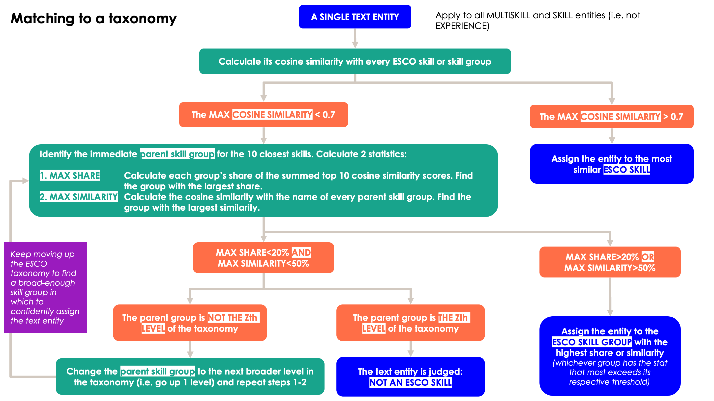

# Model Cards

This page contains information for different parts of the skills extraction and mapping pipeline. We detail the two main parts of the pipeline; the extract skills pipeline and the skills to taxonomy mapping pipeline.

Developed by data scientists in Nesta’s Data Analytics Practice, (last updated on 23-11-2022).

- [Model Card: Extract Skills](extract_skills_card)
- [Model Card: Skills to Taxonomy Mapping](mapping_card)

_An example of extracting skills and mapping them to the ESCO taxonomy._

## Model Card: Named Entity Recognition Model 

_The extracting skills pipeline._

### Summary

- Train a Named Entity Recognition (NER) spaCy component to extract skills, multiskills and experience entities from job adverts.
- Predict whether or not a skill is multi-skill or not using scikit learn's SVM model. Features are length of entity; if 'and' in entity; if ',' in entity.
- Split multiskills, where possible, based on semantic rules.

### Training

- For the NER model, 375 job adverts were labelled for skills, multiskills and experience.
- As of 15th November 2022, **5641** entities in 375 job adverts from OJO were labelled;
- **354** are multiskill, **4696** are skill, and **608** were experience entities. 20% of the labelled entities were held out as a test set to evaluate the models.

The NER model we trained used [spaCy's](https://spacy.io/) NER neural network architecture. Their NER architecture _"features a sophisticated word embedding strategy using subword features and 'Bloom' embeddings, a deep convolutional neural network with residual connections, and a novel transition-based approach to named entity parsing"_ - more about this [here](https://spacy.io/universe/project/video-spacys-ner-model).

You can read more about the creation of the labelling data [here](./labelling.md).

### NER Metrics

- A metric in the python library nerevaluate ([read more here](https://pypi.org/project/nervaluate/)) was used to calculate F1, precision and recall for the NER and SVM classifier on the held-out test set. As of 15th November 2022, the results are as follows:

| Entity     | F1    | Precision | Recall |
| ---------- | ----- | --------- | ------ |
| Skill      | 0.586 | 0.679     | 0.515  |
| Experience | 0.506 | 0.648     | 0.416  |
| All        | 0.563 | 0.643     | 0.500  |

- These metrics use partial entity matching.
- More details of the evaluation performance across both the NER model and the SVM model can be found in `outputs/models/ner_model/20220825/train_details.json`

### Multiskill Metrics

- The same training data and held out test set used for the NER model was used to evaluate the SVM model. On a held out test set, the SVM model achieved 91% accuracy.
- When evaluating the multiskill splitter algorithm rules, 253 multiskill spans were labelled as ‘good’, ‘ok’ or ‘bad’ splits. Of the 253 multiskill spans, 80 were split. Of the splits, 66% were ‘good’, 9% were ‘ok’ and 25% were ‘bad’.
- More details of the evaluation performance across both the NER model and the SVM model can be found in `outputs/models/ner_model/20220825/train_details.json`

### Caveats and Recommendations

- As we take a rules based approach to splitting multiskills, many multiskills do not get split. If a multiskill is unable to be split, we still match to a taxonomy of choice. Future work should add more rules to split multiskills.
- We deduplicate the extracted skills in the output. This means that if a job advert mentions ‘excel skills’ twice and these entities are extracted, the output will just contain "excel skills" once. However, if the string is slightly different, e.g. "excel skills" and "Excel skill", both occurrences will be outputted.
- Future work could look to train embeddings with job-specific texts, disambiguate acronyms and improve NER model performance.

## Model Card: Skills to Taxonomy Mapping 

_The methodology for matching skills to the ESCO taxonomy - threshold numbers can be changed in the config file._

### Summary

- Match to a taxonomy based on different similarity thresholds.
- First try to match at the most granular level of a taxonomy based on cosine similarity between embedded, extracted skill and taxonomy skills. Extracted and taxonomy skills are embedded using huggingface’s [sentence-transformers/all-MiniLM-L6-v2](https://huggingface.co/sentence-transformers/all-MiniLM-L6-v2) model.
- If there is no close granular skill above 0.7 cosine similarity (this threshold can be changed in configuration file), we then assign the skill to different levels of the taxonomy in one of two approaches (maximum share and maximum similarity - see diagram above for details).
- If matching to ESCO, 43 commonly occurring skills from a sample of 100,000 job adverts are hard coded.

### Model Factors

The main factors in this matching approach are: 1) the different thresholds at different levels of a taxonomy and 2) the different matching approaches.

### Caveats and Recommendations

This step does less well when:

- The extracted skill is a metaphor: i.e. 'understand the bigger picture' gets matched to 'take pictures'
- The extracted skill is an acronym: i.e. 'drafting ORSAs' gets matched to 'fine arts'
- The extracted skill is not a skill (poor NER model performance): i.e. 'assist with the' gets matched to providing general assistance to people

We recommend that:

- Skill entities might match to the same taxonomy skill; the output does not deduplicate matched skills. If deduplicating is important, you will need to deduplicate at the taxonomy level.
- The current predefined configurations ensures that every extracted skill will be matched to a taxonomy. However, if a skill is matched to the highest skill group, we label it as ‘unmatched’. Under this definition, for ESCO we identify approximately 2% of skills as ‘unmatched’.
- The configuration file contains the relevant thresholds for matching per taxonomy. These thresholds will need to be manually tuned based on different taxonomies.